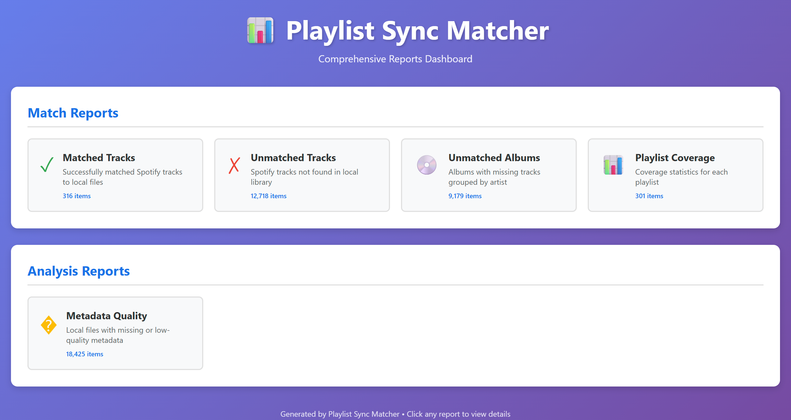
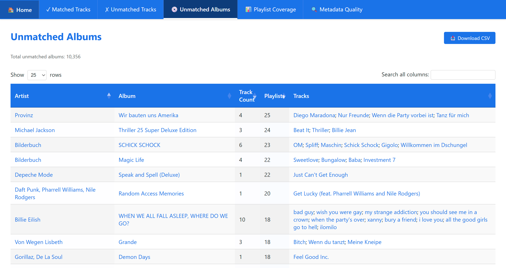

# Playlist Sync Matcher

Turn your streaming playlists (e.g. from Spotify) into M3U playlist files that point to your actual local music files. The codebase has been prepared with a lightweight abstraction so new providers can be added with minimal churn.

## What it does
Instead of just getting a list of song names, you get working playlists that:
- **Link to your local files** – Each playlist entry points to the real MP3/FLAC file on your drive
- **Show what's missing** – Missing tracks marked with ❌ emoji in mirrored mode, plus detailed reports
- **Preserve your path format** – Network drives (Z:\) vs UNC paths (\\server\share) maintained automatically
- **Keep playlists in sync** – Smart obsolete detection prompts you to clean up deleted playlists
- **Work everywhere** – Standard M3U files that any music player can use (VLC, Foobar2000, etc.)

Perfect for syncing to devices, offline listening, or just organizing your collection around your streaming habits.

## How it works
1. **Reads your Spotify playlists** – Pulls all your playlist info  
2. **Scans your music folders** – Finds all the music files you own
3. **Matches them up** – Smart matching connects streaming tracks to local files
4. **Creates M3U playlists** – Generates playlist files pointing to your actual music
5. **Reports what's missing** – Shows you exactly what tracks and albums to download

No more manually recreating playlists or wondering what you're missing from your collection.

## Rich Interactive Reports

Get comprehensive insights into your music collection with beautiful, interactive HTML reports:



**What You Get:**
- 📊 **Sortable & Searchable Tables** – Click column headers to sort, use search to filter thousands of tracks instantly
- 🔗 **Clickable Spotify Links** – Track names, playlists, and albums link directly to Spotify for easy reference
- 📈 **Match Quality Insights** – Confidence scores, match strategies, and metadata comparison side-by-side
- 🎵 **Missing Content Analysis** – See exactly which albums to download for maximum playlist coverage
- 🔍 **Library Quality Reports** – Find metadata gaps, low-bitrate files grouped by album for efficient fixing
- 📱 **Responsive Design** – Works beautifully on desktop and mobile

**Report Types:**
- **Matched Tracks** – All successful matches with confidence scores and match strategies
- **Unmatched Tracks** – What you're missing from Spotify, sorted by popularity
- **Unmatched Albums** – Missing content grouped by album for smart downloading decisions
- **Playlist Coverage** – Track completion percentage for each playlist with drill-down details
- **Metadata Quality** – Library files with missing tags or quality issues, grouped by album



All reports export as both CSV (for spreadsheets) and interactive HTML (for exploration).

## Installation

### Option 1: Standalone Executable (Easiest)
No Python required! Download pre-built binaries from [Releases](https://github.com/vtietz/playlist-sync-matcher/releases):

**Windows**:
```bash
# Download playlist-sync-matcher-windows-amd64.exe
# Rename to psm.exe for convenience
psm.exe build     # Runs the sync pipeline (after setup below)
```

**Linux/Mac**:
```bash
# Download appropriate binary
chmod +x playlist-sync-matcher-linux-amd64
./playlist-sync-matcher-linux-amd64 build     # After setup

# Or rename for convenience:
mv playlist-sync-matcher-linux-amd64 psm
./psm build
```

### Option 2: Python Source (Recommended for Development)
Requires **Python 3.9+**. The scripts will automatically set up a virtual environment:

**Windows**:
```bash
run.bat install   # Install dependencies (first time)
run.bat build     # Run sync pipeline (after setup below)
```

**Linux/Mac**:
```bash
chmod +x run.sh
./run.sh install  # Install dependencies (first time)
./run.sh build    # Run sync pipeline (after setup)
```

> **First run**: The install script creates a `.venv` directory and installs all dependencies automatically.

## Desktop GUI 🆕

A fully-featured desktop GUI is now available with PySide6 (Qt for Python):

**Launch GUI**:
**Launch GUI**:
```bash
run.bat gui          # Windows (via run script)
./run.sh gui         # Linux/Mac (via run script)

# OR via CLI command:
psm gui              # If installed globally
python -m psm.cli gui   # Direct Python invocation
```

**Features**:
- 📊 **Master-Detail Playlists** – Browse all playlists, click to see tracks with local paths
- 🎯 **Actionable Views** – Tabs for Unmatched Tracks, Matched Tracks, Coverage, Unmatched Albums, Liked Songs
- ⚡ **All CLI Actions** – Pull, Scan, Match, Export, Report, Build via toolbar buttons
- 🔄 **Watch Mode Toggle** – Enable continuous monitoring with one click
- 📝 **Live Logs** – Real-time CLI output streaming to log window
- 📈 **Progress Tracking** – Live progress bar with percentage and action labels
- 🎨 **Professional UI** – Dark-themed Qt interface with hover effects

**Architecture**:
- Zero changes to existing CLI/service code (isolated `psm/gui/` module)
- Read-only data layer using `DatabaseInterface` only (no raw SQL)
- All actions execute actual CLI commands as subprocesses (CLI parity)
- Live progress parsing from CLI stdout

**Documentation**: 
- [`psm/gui/README.md`](psm/gui/README.md) - Detailed usage, keyboard shortcuts, and architecture
- [`docs/gui-performance.md`](docs/gui-performance.md) - Performance optimization patterns for large datasets

## Getting Started

### 1. Get a Spotify Client ID

You'll need a Spotify Developer app to access your playlists:

1. Go to https://developer.spotify.com/dashboard
2. Click **Create App**
3. Fill in any name (e.g., "My Playlist Sync")
4. Add Redirect URI: `http://127.0.0.1:9876/callback`
5. Copy your **Client ID** (you don't need the Client Secret)

### 2. Configure the Tool

Create a `.env` file in the same directory as the executable (or project root):

```bash
# .env - Minimum required configuration
PSM__PROVIDERS__SPOTIFY__CLIENT_ID=your_client_id_here
PSM__LIBRARY__PATHS=["C:/Music"]
```

**Optional settings** for better results:
```bash
PSM__EXPORT__MODE=mirrored                # Show missing tracks as comments
PSM__EXPORT__ORGANIZE_BY_OWNER=true      # Group playlists by owner
```

> **Tip**: See `.env.example` for all available options.

### 3. Authenticate with Spotify

Run the login command to connect your Spotify account:

```bash
run.bat login     # Windows
./run.sh login    # Linux/Mac
psm login         # Standalone executable
```

A browser window will open for Spotify authorization. After you approve, the tool saves your credentials to `tokens.json` (auto-refreshed).

### 4. Run the Complete Sync

Now run the complete data pipeline with a single command:

```bash
run.bat build     # Windows
./run.sh build    # Linux/Mac
psm build         # Standalone executable
```

> **What does "build" mean?** The `build` command runs the complete sync pipeline (not compiling code). It executes all steps in sequence.

This will:
1. **Pull** your Spotify playlists and tracks
2. **Scan** your local music library
3. **Match** streaming tracks to local files
4. **Export** M3U playlists pointing to your files
5. **Generate** interactive HTML reports

**Find your results**:
- M3U playlists: `data/export/playlists/`
- Interactive reports: `data/export/reports/index.html`

**Open the report dashboard**:
```bash
start data\export\reports\index.html        # Windows
open data/export/reports/index.html         # Mac
xdg-open data/export/reports/index.html     # Linux
```

> **Note**: Currently only **one provider** (Spotify) can be configured. Multi-provider support is planned for a future release.

## Features

| Capability | Value |
|------------|-------|
| **M3U Export Modes** | strict (matched only), mirrored (all tracks with ❌ indicators), placeholders (dummy files) |
| **Smart Path Handling** | Preserves Z:\ vs \\server\share network paths, absolute/relative path support |
| **Playlist Cleanup** | Detects obsolete playlists with interactive deletion, optional full clean before export |
| **Owner Grouping** | Optional: organize playlists into folders by owner |
| **Liked Songs Support** | Automatic virtual playlist export for your Spotify ❤️ Liked Songs |
| **Progress Indicators** | Live progress during export ([1/302] Exporting: Playlist Name) |
| **Scoring-based Matching** | Weighted signals (exact/fuzzy/album/year/duration/ISRC) with confidence tiers |
| **Rich Reporting** | Interactive HTML + CSV: missing tracks, album completeness, coverage analysis |
| **Library Quality Analysis** | Surface metadata gaps & low bitrate files grouped by album |
| **Fast Scan Mode** | Skips unchanged files (mtime+size) to save minutes on large libraries |
| **Watch Mode** | Continuous monitoring of library and database with incremental updates |
| **Provider-Ready Architecture** | Pluggable registry & namespaced schema for future multi-provider support |
| **Clean Schema v1** | Composite (id, provider) keys for future multi-provider coexistence |

## Common Commands

> **Note**: Replace `run.bat` with `./run.sh` on Linux/Mac, or use `psm` if using standalone executable.

**Complete sync pipeline** (recommended for first-time and regular use):
```bash
run.bat build         # Runs full pipeline: pull → scan → match → export
```
> The `build` command runs the data sync pipeline, not software compilation.

**Watch Mode** 🆕 (continuously monitor and rebuild):
```bash
run.bat build --watch             # Monitor library + database for changes
run.bat build --watch --debounce 5  # Use 5-second debounce (default: 2)
run.bat build --watch --no-report  # Skip report regeneration
run.bat build --watch --no-export  # Skip playlist export
```
> **Watch mode** monitors both your **music library files** AND **database** for changes.
> 
> **Important**: Does **NOT** run initial full build - run `run.bat build` first without `--watch`.
> Then start watch mode for continuous monitoring.
>
> **How it works**:
> 
> **Library file changes** (incremental):
> - Detects file changes in library paths (add, modify, delete)
> - Scans only changed files (not entire library)
> - Matches only changed files against all tracks
> - Updates affected playlists in M3U export
> - Regenerates reports
> 
> **Database changes** (e.g., after `run.bat pull` in another terminal):
> - Detects database modification (new/changed tracks from Spotify)
> - **Incremental match**: matches all library files against only changed tracks
> - Updates affected playlists
> - Regenerates reports
> 
> **Performance**: Both library and database changes use incremental matching for fast updates (typically 3-6 seconds vs 45+ seconds for full rebuild).
> 
> **Workflow**:
> ```bash
> # Terminal 1: Start watch mode
> run.bat build --watch
> 
> # Terminal 2: Pull new Spotify data when needed
> run.bat pull
> # Watch mode will automatically detect and re-match!
> ```
> 
> Press Ctrl+C to stop.

**Individual steps** (for selective updates):
```bash
run.bat pull          # Fetch Spotify playlists and tracks
run.bat scan          # Scan local music library (smart: only new/modified files)
run.bat scan --deep   # Force complete rescan of all library paths
run.bat match         # Match tracks (smart: skips already-matched, auto-generates reports)
run.bat match --full  # Force complete re-match of all tracks
run.bat export        # Generate M3U playlists
run.bat analyze       # Analyze library quality (auto-generates quality reports)
```

**Reports**:
```bash
run.bat report        # Regenerate all reports from database
                      # Options: --match-reports, --analysis-reports, 
                      #          --no-match-reports, --no-analysis-reports
```

**Other**:
```bash
run.bat --help        # Show workflow examples
run.bat config        # Show current configuration
run.bat version       # Show version info
```

### Library Scan

Builds a searchable database of your music files:

```bash
run.bat scan                              # Smart scan: only new/modified files (default)
run.bat scan --deep                       # Force complete rescan of all library paths
run.bat scan --since "2 hours ago"        # Scan files modified in last 2 hours
run.bat scan --paths ./NewAlbum/          # Scan specific directory
run.bat scan --watch                      # Monitor filesystem and auto-update DB
```

**Features**:
- **Visual Progress**: Shows directories being scanned + live progress counter (every 100 files)
- **Smart by Default**: Only scans new/modified files (use `--deep` for complete rescan)
- **Time-Based Filtering**: `--since` scans files modified after specified time
- **Watch Mode**: `--watch` monitors library and updates DB automatically
- **Cleanup**: Automatically removes deleted files from database
- **Debug Mode**: Set `LOG_LEVEL=DEBUG` to see current directory being scanned

**Watch Mode** 🆕:
```bash
# Continuously monitor library for changes
run.bat scan --watch --debounce 2

# Changes are detected and processed automatically
# Press Ctrl+C to stop
```

See [docs/watch-mode.md](docs/watch-mode.md) for comprehensive watch mode guide.

**Example Output**:
```
Scanning 2 directories:
  • Z:\Artists\
  • Z:\Sampler\

100 files processed | 50 skipped | 38.3 files/s
200 files processed | 150 skipped | 40.4 files/s
...
✓ Library: 25 new 10 updated 1959 unchanged 6 deleted in 24.01s
```

### Automatic Reporting

Every workflow step automatically generates comprehensive reports to help you understand your collection.

#### Match Reports (`run.bat match`)

When matching tracks, you get:

**📊 Matched Tracks Report**
- Every successfully matched track with confidence score (CERTAIN/HIGH/MEDIUM/LOW)
- Match strategy used (ISRC, exact match, fuzzy match, album context, etc.)
- Side-by-side comparison: Spotify metadata ↔ Local file metadata
- Clickable Spotify track links to verify matches
- Duration comparison and match quality indicators

**❌ Unmatched Tracks Report**  
- All Spotify tracks without local matches
- Sorted by playlist popularity (tracks in multiple playlists shown first)
- Artist, album, duration, and release year for easy identification
- Clickable Spotify links to preview/purchase missing tracks
- Liked tracks marked with ❤️ for priority downloading

**💿 Unmatched Albums Report**
- Missing tracks grouped by album for efficient bulk downloading
- Shows track count per album to prioritize complete album acquisitions
- Sorted by frequency (albums appearing in multiple playlists listed first)
- Perfect for identifying "which albums should I buy next?"

**📈 Playlist Coverage Report**
- Coverage percentage for each of your playlists
- Track counts: Total, Matched, Missing for every playlist
- Clickable playlist names link to Spotify
- Drill-down links to detailed per-playlist track reports
- Owner information and playlist URLs
- **Includes "Liked Songs" (❤️) as a virtual playlist** - tracks you've liked in Spotify

**Console Output:**
- Top 20 unmatched tracks by popularity (configurable)
- Top 10 unmatched albums by occurrence frequency (configurable)
- Quick summary of match quality and coverage

### Liked Songs Support 🆕

Your Spotify "Liked Songs" (Lieblingssongs/❤️) are automatically included:

**✅ Automatic Pull**: `run.bat pull` fetches liked tracks alongside playlists  
**✅ Matching**: Liked tracks are matched just like playlist tracks  
**✅ Export**: A virtual "Liked Songs" playlist is created automatically (M3U file)  
**✅ Reports**: Liked Songs appear in all coverage and track reports  
**✅ Incremental**: Only new liked tracks are fetched on subsequent pulls

**Control via Config**:
```bash
# Disable Liked Songs export (still pulled and matched, just not exported)
PSM__EXPORT__INCLUDE_LIKED_SONGS=false
```

**Sorting**: Liked Songs M3U preserves Spotify's newest-first order (most recently liked at the top).

#### Analysis Reports (`run.bat analyze`)

Library quality analysis helps you improve match accuracy:

**🔍 Metadata Quality Report**
- Files with missing tags (artist, title, album, year)
- Files below bitrate threshold (default: 320 kbps)
- Grouped by issue type for targeted fixing
- Full file paths for easy batch editing
- Bitrate and duration information

**Console Output with Intelligent Grouping:**
- Top albums with most files needing fixes
- Example: "📁 The Beatles - Abbey Road (18 files missing year)"
- Maximizes impact: Fix one album's metadata → improve many files at once
- Prioritizes albums over scattered individual files

#### Standalone Report Generation

Regenerate all reports from existing database without re-running analysis:

```bash
run.bat report                       # Generate all reports (default)
run.bat report --no-analysis-reports # Generate only match reports
run.bat report --no-match-reports    # Generate only analysis reports
```

Perfect for tweaking report formats or sharing results without re-processing.

#### Interactive HTML Features

All HTML reports include sortable tables, live search, pagination, clickable Spotify links, and CSV export. Powered by jQuery DataTables.

### Troubleshooting Unmatched Tracks 🔍

When tracks don't match, use the `diagnose` command to understand why:

**Workflow:**
1. Check `unmatched_tracks` report (CSV or HTML)
2. Copy the Track ID from the first column
3. Run diagnose command:

```bash
run.bat diagnose <track_id>
```

**What you'll see:**
- **Track metadata**: Artist, title, album, duration, normalized string
- **Match status**: Already matched, or why not
- **Top 5 closest files**: With fuzzy match scores and duration comparison
- **Recommendations**: Specific fixes (tag corrections, threshold adjustments)

**Example:**
```bash
# Diagnose a specific unmatched track
run.bat diagnose 3n3Ppam7vgaVa1iaRUc9Lp

# Show top 10 closest files instead of 5
run.bat diagnose --top-n 10 3n3Ppam7vgaVa1iaRUc9Lp
```

**Common issues revealed:**
- File tags don't match Spotify metadata (artist/title spelling)
- Match score just below threshold (→ lower threshold slightly)
- File not in library (→ download and scan)
- Duration mismatch too large (→ check if correct version)

See [docs/troubleshooting.md](docs/troubleshooting.md) for more details.

**Reports Location:** `data/export/reports/` (configurable via `PSM__REPORTS__DIRECTORY`)

**Open Reports:**
```bash
start data\export\reports\index.html        # Windows
open data/export/reports/index.html         # Mac
xdg-open data/export/reports/index.html     # Linux
```

See `docs/matching.md` and `docs/library_analysis.md` for detailed report documentation.

### Single Playlist Operations

Work with individual playlists instead of syncing everything:

```bash
run.bat playlists list                      # List all playlists with IDs
run.bat playlists list --show-urls          # Include Spotify URLs

run.bat playlist pull <PLAYLIST_ID>         # Pull single playlist from Spotify
run.bat playlist match <PLAYLIST_ID>        # Match against library
run.bat playlist export <PLAYLIST_ID>       # Export to M3U
run.bat playlist build <PLAYLIST_ID>        # Pull + match + export

# Experimental: Push local order back to Spotify (preview first, then --apply)
run.bat playlist push <PLAYLIST_ID>         # Preview changes
run.bat playlist push <PLAYLIST_ID> --apply # Apply changes
```

**Use cases:** Testing settings, selective updates, debugging specific playlists, faster processing.

**M3U features:** Each exported playlist includes Spotify URL in header and collision-safe filenames (`PlaylistName_<8charID>.m3u8`).

See `docs/` for complete playlist command documentation.

### Export Modes & Features 🎵

The tool offers flexible M3U playlist export with smart features for managing your playlists:

#### **Export Modes**

**Strict Mode** (default for reliability)
- Only includes tracks with local file matches
- Cleanest playlists for guaranteed playback
- Missing tracks silently omitted

**Mirrored Mode** (recommended for completeness)
- Preserves ALL tracks from Spotify playlist
- Missing tracks marked with ❌ emoji in title (visible in player UI)
- Placeholder entries: `!MISSING - Artist - Title`
- Perfect for tracking what you need to download

**Placeholders Mode** (for advanced workflows)
- Creates dummy `.missing` files for unmatched tracks
- Maintains playlist order with physical files
- Useful for scripting batch downloads

#### **Smart Playlist Cleanup** 🆕

Keep your export directory synchronized:

**Obsolete Detection** (enabled by default)
- Automatically finds playlists that were deleted from Spotify
- Interactive prompt lists obsolete files with option to delete
- Example output:
  ```
  ⚠ Found 3 obsolete playlist(s):
    • Old_Deleted_Playlist_abc123.m3u
    • Temp_Test_List_def456.m3u
  
  Delete obsolete playlists? [y/N]:
  ```

**Clean Before Export** (optional, disabled by default)
- `PSM__EXPORT__CLEAN_BEFORE_EXPORT=true` deletes ALL .m3u files before export
- Safest option but removes any manual additions
- Use for "fresh start" after major library reorganization

**Configuration:**
```bash
PSM__EXPORT__DETECT_OBSOLETE=true       # Default: detect and prompt
PSM__EXPORT__CLEAN_BEFORE_EXPORT=false  # Default: keep existing files
```

#### **Network Path Preservation** 🆕

Automatically preserves your configured path format:

- **Z:\Artists\Album\Song.mp3** → Stays as drive letter if configured that way
- **\\\\server\share\Artists\Album\Song.mp3** → Stays as UNC if configured that way
- **Works by**: Matching database absolute paths against your `PSM__LIBRARY__PATHS` config
- **Cross-platform**: Pure Python, no Windows-specific commands

**Configuration:**
```bash
PSM__LIBRARY__PATHS=["Z:/Artists","Z:/Sampler"]  # Your mount points
PSM__EXPORT__USE_LIBRARY_ROOTS=true              # Enable path reconstruction (default)
PSM__EXPORT__PATH_FORMAT=absolute                # absolute or relative (default: absolute)
```

#### **Live Progress Indicators** 🆕

See export progress in real-time:
```
▶ Exporting playlists to M3U
[1/302] Exporting: Chill Vibes
[2/302] Exporting: Workout Mix
[3/302] Exporting: Road Trip
...
[302/302] Exporting: Late Night Jazz
Exporting Liked Songs as virtual playlist (1624 tracks)
✓ Exported 302 playlists to Z:\Playlists\Spotify
✓ Export complete
```

#### **Visual Missing Track Indicators** 🆕

Mirrored mode makes missing tracks obvious in any player:

**In M3U file:**
```m3u
#EXTM3U
#EXTINF:180,Artist - Song Title
Z:\Artists\Artist\Song.mp3
#EXTINF:215,❌ Artist - Missing Song
!MISSING - Artist - Missing Song
```

**In your media player:**
- ✅ **Artist - Song Title** (plays normally)
- ❌ **Artist - Missing Song** (visible as missing, shows download priority)

## Configuration

All configuration via `.env` file or environment variables using the pattern `PSM__SECTION__KEY`.

**Minimal `.env` example:**
```bash
PSM__PROVIDERS__SPOTIFY__CLIENT_ID=your_client_id_here
PSM__LIBRARY__PATHS=["C:/Music"]
PSM__EXPORT__MODE=mirrored
PSM__EXPORT__ORGANIZE_BY_OWNER=true
```

**Common settings:**
- `PSM__MATCHING__FUZZY_THRESHOLD` - Match sensitivity 0.0-1.0 (default: 0.78)
- `PSM__MATCHING__DURATION_TOLERANCE` - Seconds (default: 2.0)
- `PSM__LIBRARY__FAST_SCAN` - Skip unchanged files (default: true)
- `PSM__LOG_LEVEL` - DEBUG|INFO|WARNING (default: INFO)

**Export options:**
- `PSM__EXPORT__MODE` - strict|mirrored|placeholders (default: strict)
- `PSM__EXPORT__ORGANIZE_BY_OWNER` - Group by owner (default: true)
- `PSM__EXPORT__INCLUDE_LIKED_SONGS` - Export Liked Songs playlist (default: true)
- `PSM__EXPORT__PATH_FORMAT` - absolute|relative paths (default: absolute)
- `PSM__EXPORT__USE_LIBRARY_ROOTS` - Preserve Z:\ vs \\server\share (default: true)
- `PSM__EXPORT__CLEAN_BEFORE_EXPORT` - Delete all .m3u before export (default: false)
- `PSM__EXPORT__DETECT_OBSOLETE` - Prompt to delete obsolete playlists (default: true)

**Temporary override** (without editing `.env`):
```bash
set PSM__EXPORT__MODE=strict && run.bat export     # Windows
PSM__EXPORT__MODE=strict ./run.sh export           # Linux/Mac
```

See `docs/configuration.md` for complete list of all options and `.env.example` for examples.

## Advanced Usage

### Debug Mode
```bash
PSM__LOG_LEVEL=DEBUG run.bat match    # Detailed diagnostics
```

### Re-authenticate
```bash
run.bat login --force                  # Force fresh Spotify login
```

### Optional HTTPS Redirect
```bash
# In .env file:
PSM__PROVIDERS__SPOTIFY__REDIRECT_SCHEME=https
PSM__PROVIDERS__SPOTIFY__REDIRECT_HOST=localhost
```
Register `https://localhost:9876/callback` in Spotify Dashboard. Tool auto-generates cert if available.

## Technical Details

Brief overview (see `docs/architecture.md` for comprehensive details):

- **Database**: SQLite with composite (id, provider) keys for multi-provider support
- **Matching**: Weighted scoring system with confidence tiers (CERTAIN/HIGH/MEDIUM/LOW)
- **Performance**: LRU caching, fast scan mode, bulk inserts, indexed columns
- **Concurrency**: WAL mode enables safe parallel operations (pull + scan + match simultaneously)
- **Schema**: Clean v1 baseline with provider namespacing

For technical deep-dives, see `docs/architecture.md` and `docs/matching.md`.

## Troubleshooting

**INVALID_CLIENT error?**
- Check redirect URI: `run.bat redirect-uri`
- Default is `http://127.0.0.1:9876/callback`
- Must match exactly in Spotify Developer Dashboard

**Low match rate?**
- Run `run.bat analyze` to find metadata issues
- Check reports: `data/export/reports/index.html`
- See `docs/troubleshooting.md` for detailed solutions

**Need detailed logs?**
```bash
PSM__LOG_LEVEL=DEBUG run.bat match
```

See `docs/troubleshooting.md` for complete troubleshooting guide.

## Multi-Provider Architecture

Implemented: provider column + composite keys, provider registry, config key `provider`.
Next steps (external contributions welcome):
- Additional provider client(s)
- Optional ISRC-centric canonical cross-provider table
- Playlist cloning between providers
- Rate limiting & unified error model

See: `docs/providers.md` for full integration guide.

## License

MIT License

---

## Developer Docs

Development, release process, and provider extension details live in the `docs/` directory:

**User Guides:**
- `docs/architecture.md` - System design and components
- `docs/matching.md` - Match algorithm and strategies
- `docs/configuration.md` - All configuration options
- `docs/library_analysis.md` - Report generation details
- `docs/troubleshooting.md` - Common issues and solutions
- `docs/watch-mode.md` - Watch mode guide

**Development:**
- `docs/development.md` - Development setup and workflow
- `docs/providers.md` - Adding new streaming providers

---

**Need Help?** Quick references:
- `run.bat config` - View current settings
- `run.bat redirect-uri` - Show OAuth redirect
- `.env.example` - All environment variables
- `PSM__LOG_LEVEL=DEBUG` - Enable detailed diagnostic logging
Values starting with `[` or `{` are parsed as JSON; objects are supported (see configuration docs).
