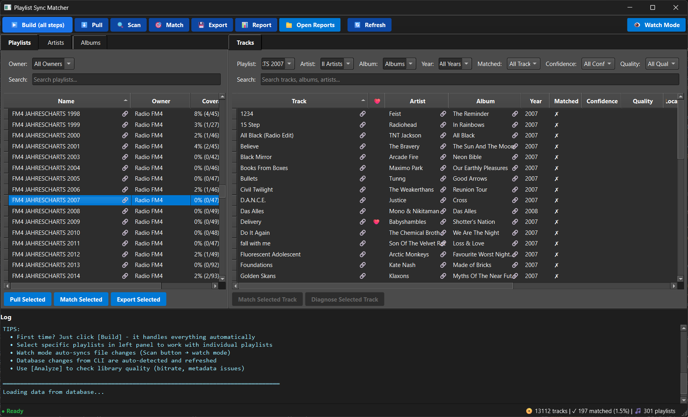

# Playlist Sync Matcher

Turn your streaming playlists (e.g. from Spotify) into M3U playlist files that point to your actual local music files.

## What it does

Instead of just getting a list of song names, you get working playlists that:
- **Link to your local files** – Each playlist entry points to the real MP3/FLAC file on your drive
- **Show what's missing** – Missing tracks marked with ❌ emoji in mirrored mode, plus detailed reports
- **Preserve your path format** – Network drives (Z:\) vs UNC paths (\\server\share) maintained automatically
- **Keep playlists in sync** – Detects obsolete playlists and prompts for cleanup
- **Work everywhere** – Standard M3U files that any music player can use (VLC, Foobar2000, etc.)

Perfect for syncing to devices, offline listening, or just organizing your collection around your streaming habits.

## Features

| Capability | Value |
|------------|-------|
| **M3U Export Modes** | strict (matched only), mirrored (all tracks with ❌ indicators), placeholders (dummy files) |
| **Smart Path Handling** | Preserves Z:\ vs \\server\share network paths, absolute/relative path support |
| **Playlist Cleanup** | Detects obsolete playlists with interactive deletion, optional full clean before export |
| **Liked Songs Support** | Automatic virtual playlist export for your Spotify ❤️ Liked Songs |
| **Scoring-based Matching** | Weighted signals (exact/fuzzy/album/year/duration/ISRC) with confidence tiers |
| **Rich Reporting** | Interactive HTML + CSV: missing tracks, album completeness, coverage analysis |
| **Library Quality Analysis** | Surface metadata gaps & low bitrate files grouped by album |
| **Fast Scan Mode** | Skips unchanged files (mtime+size) to save minutes on large libraries |
| **Watch Mode** | Continuous monitoring of library and database with incremental updates |
| **Provider-Ready Architecture** | Pluggable registry; multi-provider support planned ([docs/providers.md](docs/providers.md)) |

## Two Ways to Use

### Command-Line Interface (CLI)

Perfect for automation, scripting, and power users.

**Quick Example:**
```bash
psm-cli login         # Authenticate with Spotify
psm-cli build         # Pull → Scan → Match → Export (complete pipeline)
psm-cli build --watch # Continuous monitoring mode
```

📖 **[Complete CLI Reference](docs/cli-reference.md)** - All commands, options, and workflow examples

### Graphical Desktop App (GUI)



Visual interface for interactive exploration. Runs the same CLI engine under the hood.

**Features:**
- 📊 Master–Detail Playlists with powerful filters
- ⚡ All CLI actions via toolbar buttons
- 🔄 Watch mode toggle
- 📝 Live log streaming
- 🎨 Professional dark-themed Qt interface

📖 **[GUI Documentation](psm/gui/README.md)** - Usage, keyboard shortcuts, and architecture

## Installation

### Option 1: Prebuilt Bundles (Easiest)

No Python required! Download platform bundle from [Releases](https://github.com/vtietz/playlist-sync-matcher/releases):

- **Windows**: `psm-windows-amd64.zip` → contains `psm-gui.exe` and `psm-cli.exe`
- **macOS**: `psm-macos-amd64.tar.gz` → contains `psm-gui` and `psm-cli`
- **Linux**: `psm-linux-amd64.tar.gz` → contains `psm-gui` and `psm-cli`

**Usage:**
```bash
# Windows
psm-gui.exe           # Desktop application
psm-cli.exe build     # Command-line

# Linux/Mac
chmod +x psm-gui psm-cli
./psm-gui             # Desktop application
./psm-cli build       # Command-line
```

### Option 2: Python Source (Development)

Requires **Python 3.10+**. Scripts automatically set up virtual environment:

**Windows**:
```bash
run.bat install      # Install dependencies (first time)
run.bat psm build    # Run sync pipeline
run.bat build        # Build executables
```

**Linux/Mac**:
```bash
chmod +x run.sh
./run.sh install     # Install dependencies (first time)
./run.sh psm build   # Run sync pipeline
./run.sh build       # Build executables
```

## Getting Started

### 1. Get a Spotify Client ID

1. Go to https://developer.spotify.com/dashboard
2. Click **Create App**
3. Add Redirect URI: `http://127.0.0.1:9876/callback`
4. Copy your **Client ID**

### 2. Configure the Tool

Create a `.env` file in the same directory as the executable (or project root):

```bash
# .env - Minimum required configuration
PSM__PROVIDERS__SPOTIFY__CLIENT_ID=your_client_id_here
PSM__LIBRARY__PATHS=["C:/Music"]
```

**Recommended settings:**
```bash
PSM__EXPORT__MODE=mirrored                # Show missing tracks
PSM__EXPORT__ORGANIZE_BY_OWNER=true      # Group by owner
```

> **Tip**: See `.env.example` for all options or [docs/configuration.md](docs/configuration.md) for details.

### 3. Authenticate with Spotify

```bash
psm-cli login         # Standalone executable
run.bat psm login     # Windows source
./run.sh psm login    # Linux/Mac source
```

Browser opens for authorization. Credentials saved to `tokens.json`.

### 4. Run the Complete Sync

```bash
psm-cli build         # Standalone
run.bat psm build     # Windows source
./run.sh psm build    # Linux/Mac source
```

This executes the complete pipeline:
1. **Pull** playlists from Spotify
2. **Scan** local music library  
3. **Match** tracks to local files
4. **Export** M3U playlists
5. **Generate** HTML reports

**Find your results**:
- M3U playlists: `data/export/playlists/`
- Reports: `data/export/reports/index.html`

## Common Commands

> **📖 For complete details**: See [docs/cli-reference.md](docs/cli-reference.md)

**Complete sync pipeline**:
```bash
psm build                    # Full pipeline: pull → scan → match → export
psm build --watch            # Continuous monitoring mode
```

**Individual steps** (selective updates):
```bash
psm pull          # Fetch Spotify playlists
psm scan          # Scan local library
psm match         # Match tracks (auto-generates reports)
psm export        # Generate M3U playlists
psm analyze       # Library quality analysis
```

**Diagnostics**:
```bash
psm diagnose <track_id>      # Debug why track didn't match
psm config                   # Show current configuration
psm report                   # Regenerate all reports
```

**Watch Mode** - Continuous monitoring:
```bash
psm build --watch                   # Monitor library + database
psm build --watch --debounce 5      # Custom debounce time
```

Watch mode monitors **both** your music library files AND database for changes, using incremental matching for fast updates (3-6 seconds vs 45+ seconds for full rebuild).

See [docs/watch-mode.md](docs/watch-mode.md) for comprehensive watch mode guide.

## Rich Interactive Reports


Get comprehensive insights with beautiful, interactive HTML reports:

- 📊 **Sortable & Searchable Tables** – Filter thousands of tracks instantly
- 🔗 **Clickable Spotify Links** – Direct links to tracks, albums, playlists
- 📈 **Match Quality Insights** – Confidence scores and metadata comparison
- 🎵 **Missing Content Analysis** – See exactly which albums to download
- 📱 **Responsive Design** – Works on desktop and mobile

**Report Types:**
- **Matched Tracks** – All matches with confidence scores
- **Unmatched Tracks** – Missing tracks sorted by popularity
- **Unmatched Albums** – Missing content grouped by album
- **Playlist Coverage** – Track completion % for each playlist
- **Metadata Quality** – Files with missing tags or quality issues

All reports export as both CSV and interactive HTML.

## Key Features Explained

### Export Modes

**Strict** (default): Only matched tracks  
**Mirrored** (recommended): All tracks, missing ones marked with ❌  
**Placeholders**: Creates dummy `.missing` files

```bash
# Configure in .env
PSM__EXPORT__MODE=mirrored
```

### Liked Songs Support

Your Spotify ❤️ Liked Songs are automatically:
- Pulled alongside playlists
- Matched to local files
- Exported as virtual playlist
- Included in coverage reports

```bash
# Control via config
PSM__EXPORT__INCLUDE_LIKED_SONGS=true
```

### Smart Playlist Cleanup

Automatically detects playlists deleted from Spotify and prompts for removal:

```
⚠ Found 3 obsolete playlist(s):
  • Old_Deleted_Playlist_abc123.m3u
  
Delete obsolete playlists? [y/N]:
```

### Manual Match Override

Override automatic matching when needed:

```bash
psm set-match --track-id <spotify_id> --file-path <path>
psm remove-match --track-id <spotify_id>
```

See [docs/cli-reference.md](docs/cli-reference.md) for complete examples.

## Configuration

All configuration via `.env` file or environment variables (`PSM__SECTION__KEY`).

**Common settings:**
```bash
# Matching
PSM__MATCHING__FUZZY_THRESHOLD=0.78       # Match sensitivity (0.0-1.0)
PSM__MATCHING__DURATION_TOLERANCE=2.0     # Seconds

# Export
PSM__EXPORT__MODE=mirrored                # strict|mirrored|placeholders
PSM__EXPORT__ORGANIZE_BY_OWNER=true      # Group by owner
PSM__EXPORT__PATH_FORMAT=absolute        # absolute|relative

# Library
PSM__LIBRARY__FAST_SCAN=true             # Skip unchanged files
PSM__LIBRARY__PATHS=["C:/Music"]          # Music directories

# Logging
PSM__LOG_LEVEL=INFO                       # DEBUG|INFO|WARNING
```

See [docs/configuration.md](docs/configuration.md) for complete reference.

## Troubleshooting

**INVALID_CLIENT error?**
```bash
psm redirect-uri                    # Check OAuth redirect
# Must be http://127.0.0.1:9876/callback in Spotify Dashboard
```

**Low match rate?**
```bash
psm analyze                         # Find metadata issues
psm diagnose <track_id>             # Debug specific track
```

**Need detailed logs?**
```bash
PSM__LOG_LEVEL=DEBUG psm match
```

See [docs/troubleshooting.md](docs/troubleshooting.md) for complete guide.

## Documentation

**User Guides:**
- [docs/cli-reference.md](docs/cli-reference.md) - Complete CLI command reference
- [docs/configuration.md](docs/configuration.md) - All configuration options
- [docs/watch-mode.md](docs/watch-mode.md) - Watch mode guide
- [docs/matching.md](docs/matching.md) - Match algorithm details
- [docs/troubleshooting.md](docs/troubleshooting.md) - Common issues
- [psm/gui/README.md](psm/gui/README.md) - GUI documentation

**Development:**
- [docs/development.md](docs/development.md) - Development setup
- [docs/architecture.md](docs/architecture.md) - System design
- [docs/providers.md](docs/providers.md) - Adding providers

## License

MIT License
