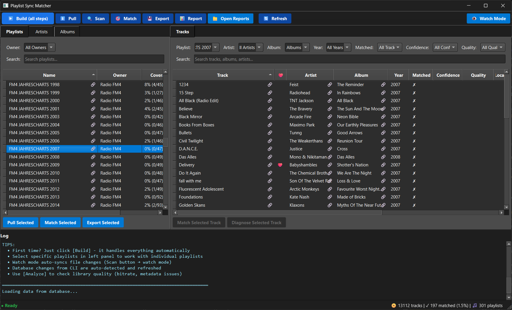

## playlist-sync-matcher (PSM)

Have you ever wondered which tracks in your streaming playlists you already own, which ones are missing, and how to create working local playlists without manually rebuilding them? **playlist-sync-matcher (PSM)** is a small personal project designed to bridge the gap between streaming playlists (currently Spotify) and your local music library. It generates M3U/M3U8 playlists that point to real files and highlights what is missing, saving you time and effort.

GitHub: https://github.com/vtietz/playlist-sync-matcher

### What It Does (and What It Doesn't)
PSM automates mapping your streaming playlists to the music files you already have locally:
- **Links to your local files** – Each playlist entry points to the real MP3/FLAC file on your drive.
- **Shows what's missing** – Clear reports of tracks and albums you don't have locally.
- **Creates standard M3U playlists** – Compatible with any music player.

> Important: PSM does not download, copy, or sync audio files. It only creates playlists that reference files already on your disk and highlights gaps. If a track is missing, you'll see it in the reports so you can acquire it yourself.

This tool is for music collectors who want to organize their collection around their streaming habits and use their existing local files in standard players.

### Key Features
- **Spotify Integration**: Playlists + liked tracks ingestion via OAuth.
- **Fast Library Scanning**: Mtime+size-based fast-scan mode skips unchanged files.
- **Intelligent Matching**: Layered scoring engine with confidence tiers (CERTAIN/HIGH/MEDIUM/LOW).
  - Multiple signals: exact/fuzzy text, album context, year, duration, ISRC.
  - Early exit optimization on high-confidence matches.
- **Flexible Export**: Three modes (strict | mirrored | placeholders) with collision-safe filenames.
- **Optional Organization**: Group playlists by owner into folders.
- **Optional GUI**: A simple desktop app that runs the same engine with a visual interface (see below).
- **Lean Watch Mode**: Continuously monitors your library and database for changes and applies incremental updates. Avoids full rebuilds; typically reacts in seconds with a small debounce.
- **Rich Interactive Reports**: Comprehensive HTML + CSV reports with sorting, search, pagination.
  - Matched tracks with confidence scores and match strategies.
  - Unmatched tracks/albums sorted by popularity for smart acquisition decisions.
  - Playlist coverage analysis with drill-down details.
  - Library quality analysis (missing metadata, low bitrate detection).
  - Clickable Spotify links throughout all reports.
  - Responsive dashboard (`index.html`) for easy navigation.
- **Match Diagnostics**: Console output + detailed reports for investigating edge cases.
- **Quality Analysis**: Identifies metadata gaps and low-bitrate files, grouped by album for efficient fixing.
- **Provider-Ready Architecture**: Composite `(id, provider)` schema + registry for future multi-service support.

### Typical Workflow
```bash
psm login      # OAuth authentication (first time)
psm pull       # Fetch Spotify playlists and tracks
psm scan       # Index local music files
psm match      # Match streaming tracks to local files (auto-generates reports)
psm export     # Generate M3U playlists
psm analyze    # Analyze library quality (auto-generates quality reports)
```
Or run the complete data sync pipeline in one command:
```bash
psm build      # Runs full pipeline: pull → scan → match → export
```
> Note: `build` runs the data sync pipeline, not software compilation.

For continuous updates while you change your library or pull new data:
```bash
psm build --watch   # Lean watch mode with incremental updates
```

**Explore Results:**
```bash
# Open the interactive report dashboard
start data/export/reports/index.html  # Windows
open data/export/reports/index.html   # Mac/Linux
```

**Individual Reports Include:**
- **Matched Tracks** – All successful matches with confidence scores, strategies, and metadata comparison.
- **Unmatched Tracks** – Missing tracks sorted by playlist popularity, with Spotify links for easy acquisition.
- **Unmatched Albums** – Gaps grouped by album to guide strategic downloading.
- **Playlist Coverage** – Completion percentage per playlist with drill-down to track-level details.
- **Metadata Quality** – Files with missing tags or low bitrate, grouped by album for batch fixing.

All reports are sortable, searchable, and include clickable Spotify links powered by jQuery DataTables.

### GUI (Optional)

There's also a small desktop app if you prefer a visual workflow. It uses the same underlying CLI and configuration.



What it offers:
- Master–detail view: playlists on the left, tracks on the right
- Toolbar actions: Build, Pull, Scan, Match, Export, Report, Open Reports, Refresh, Watch Mode
- Quick filters: Playlist, Artist, Album, Year, Matched, Confidence, Quality, plus search
- Live log panel and a status bar with totals (tracks, matched %, playlists)
The GUI is optional; the CLI remains the primary interface.
### Technical Notes
- Implemented in Python (3.10+) with standalone executables built via PyInstaller (CI currently builds with Python 3.12).
- GUI built with PySide6 (Qt for Python); uses CLI subprocesses for actions and streams logs/status to the UI.
- SQLite database with indexes on normalized text and ISRC fields for fast lookups.
- Service layer keeps CLI thin (separation of concerns).
- Environment/.env-based configuration (`PSM__SECTION__KEY` pattern).
- Caching + batching for performance (normalization cache, batched commits).
- Safe single-process DB access (simple locking).

### Why It Exists
PSM was created to simplify the process of syncing streaming playlists with local libraries. Instead of manually searching for tracks or rebuilding playlists, PSM automates the process—matching streaming tracks to local files, highlighting gaps, and exporting ready-to-use playlists. This saves time, reduces frustration, and helps you get the most out of both your streaming subscriptions and your own music collection.

### Contribute
I hope this project is useful to others! If you'd like to see support for additional streaming providers or have ideas for improvements, contributions are welcome. Check out the repository on GitHub: https://github.com/vtietz/playlist-sync-matcher.