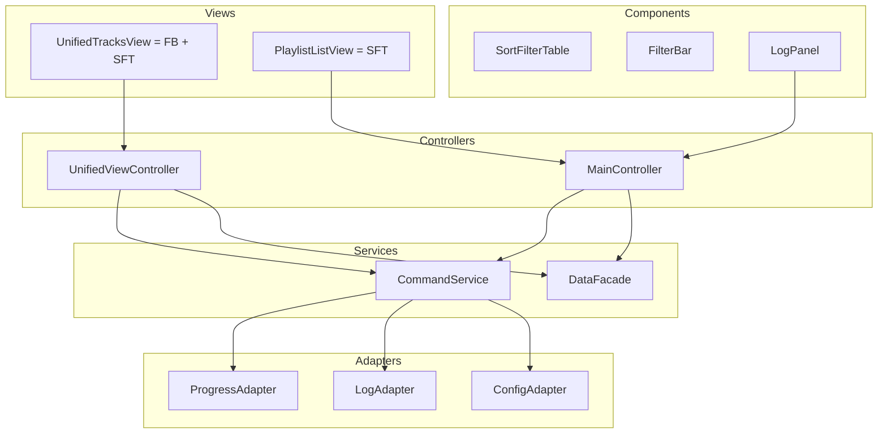

Architecture guidelines summary with emphasis on composition and clean code

Principles
- Composition-first UI
  - Build small, focused widgets and compose them into larger views. Avoid monolithic UI classes; prefer many small components with clear boundaries.
  - Example anchors: [MainWindow.declaration()](psm/gui/main_window.py:25), [MainController.declaration()](psm/gui/controllers.py:15)
- Layered separation of concerns
  - Views (widgets) render and emit signals.
  - Controllers orchestrate user interactions and route to services.
  - Services perform application logic (commands/data).
  - Adapters normalize external formats (CLI progress, config).
  - Models only adapt data for display (Qt roles).
  - Example anchors: [BaseTableModel.declaration()](psm/gui/models.py:13), [CliRunner.declaration()](psm/gui/runner.py:18), [CliExecutor.declaration()](psm/gui/runner.py:103), [parse_progress()](psm/gui/progress_parser.py:53)
- Reuse through components
  - Extract reusable UI components:
    - SortFilterTable: table + proxy with proper sort roles and filter APIs
    - FilterBar: owners/tracks/albums/search filters emitting signals
    - LogPanel: QTextEdit with emoji-capable font and append/clear API
  - Reuse across playlists, detail, matched/unmatched, unified tracks
- Clean contracts
  - Views expose signals and minimal setters (enable/disable, setProgress, appendLog).
  - Controllers accept interfaces (CommandService, DataFacade) to decouple from concrete implementations.
  - Models expose raw values under Qt.UserRole and formatted under Qt.DisplayRole for correct sorting.
- Small files, focused classes
  - UI component files should stay concise: target under ~300–400 lines per file.
  - One class = one responsibility. Split when classes grow (e.g., move filter bar or table logic to their own files).
- Consistent naming and typing
  - Use explicit type hints across controllers/services/adapters. Keep docstrings describing inputs/outputs and side effects.
- Robust execution model
  - Single command running at a time with queued or rejected re-entrancy (guard via executor.is_running()).
  - Unified lifecycle: pre-disable actions, clear log, set progress; stream logs/progress; post-enable actions and refresh data.
  - Safe cancellation and cleanup.
- Error normalization
  - Map known CLI/service errors (e.g., config schema mismatches) to friendly, actionable messages in the UI. Do not leak stack traces into the view.
- Centralized styling
  - Maintain styles in style.qss and target widgets via objectName. Avoid ad hoc styling in code.
  - Ensure full-width tables using QHeaderView.Stretch, and remove unwanted borders via stylesheet.
  - Anchor: [style.qss](psm/gui/resources/style.qss)
- Testability
  - Controllers: unit tests with mocked CommandService, DataFacade.
  - Views: pytest-qt for header sorting, filter interactions, emoji rendering in LogPanel.
  - Services/adapters: unit tests for progress parsing, config normalization, error mapping.
- Data immutability at view boundaries
  - Treat DataFacade outputs as read-only DTOs. Models transform values for display and sort without mutating source lists.
- Accessibility and UX consistency
  - Clickable sortable headers across all tables.
  - Default alphabetical sorting for playlists.
  - Filters and search apply consistently to visible dataset.
  - Emoji-capable fonts for logs and status labels.

Structure (feature-oriented, composition-friendly)
- psm/gui/components/
  - sort_filter_table.py: [SortFilterTable.declaration()](psm/gui/components/sort_filter_table.py:1)
  - filter_bar.py: [FilterBar.declaration()](psm/gui/components/filter_bar.py:1)
  - log_panel.py: [LogPanel.declaration()](psm/gui/components/log_panel.py:1)
- psm/gui/views/
  - unified_tracks_view.py: [UnifiedTracksView.declaration()](psm/gui/views/unified_tracks_view.py:1)
- psm/gui/services/
  - command_service.py: [CommandService.declaration()](psm/gui/services/command_service.py:1)
- psm/gui/adapters/
  - progress_adapter.py: [ProgressAdapter.declaration()](psm/gui/adapters/progress_adapter.py:1)
  - log_adapter.py: [LogAdapter.declaration()](psm/gui/adapters/log_adapter.py:1)
  - config_adapter.py: [ConfigAdapter.declaration()](psm/gui/adapters/config_adapter.py:1)

Mermaid diagram (composition emphasis)

Acceptance criteria
- UI files remain small and focused; composition through components avoids bloat in [MainWindow.declaration()](psm/gui/main_window.py:25).
- All tables use a single SortFilterTable component with sort role and filter APIs; headers are clickable and sort numerically where applicable.
- Playlist list defaults to alphabetical sort and shows no unwanted border.
- Command execution is standardized via CommandService with clear lifecycle and error normalization; controllers do not directly manage subprocesses.
- Logs display all Unicode/emoji characters consistently.
- Tests cover controllers, components, and adapters; style.qss centralizes visuals.

These guidelines enforce a clean, reusable, and testable GUI architecture with composition at its core and clear boundaries among views, controllers, services, adapters, and models.